# 4-Bit-CLA

The top level design of the carry lookahead adder is as follows

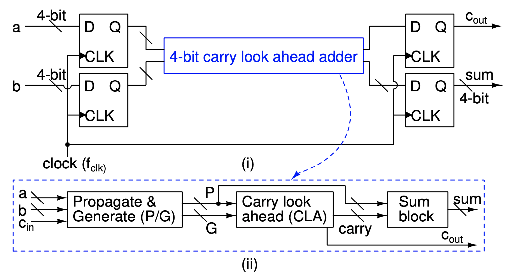

The input and outputs follow the clock pulse as shown

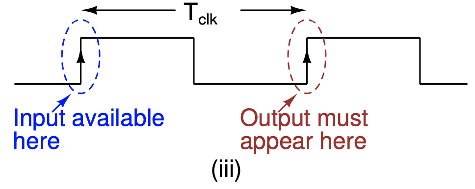

In a CLA adder we input the 4 bit numbers and a carry in ($c_0$). In the first stage of the CLA we generate the propagate and generate signals for each bit of the input as follows

$P_i = A_i \oplus B_i$

$G_i = A_i\cdot B_i$

and the carry out $c_{i+1}$ of the $i^{th}$ bit position can be generated as follows 

$C_{i+1} = P_i\cdot C_i + G_i$             $i=1,2,3,4$

The $Sum$ can be generated as follows 

$Sum_i = P_i \oplus C_i$ 

# Structure for adder

## Derivation

We have 

$P_i = A_i \oplus B_i$

$G_i = A_i\cdot B_i$

$C_{i+1} = P_i\cdot C_i + G_i$             

$Sum_i = P_i \oplus C_i$

where $i=0,1,2,3$

Let the input carry be $C_0$.

$C_0=C_{in}$

using the equation for finding further carries we get 

$C_1=P_0\cdot C_0+G_0$$=P_0\cdot C_{in}+G_0$

$C_2=P_1\cdot C_1+G_1$$=P_1\cdot (P_0\cdot C_0+G_0)+G_1$

 $=P_1\cdot P0\cdot C_0+P_1\cdot G_0+G_1$

$C_3=P_2\cdot C_2+G_2$$=P_2\cdot (P_1\cdot C_1+G_1)+G_2$ 

 $=P_2\cdot P1\cdot C_1+P_2\cdot G_1+G_2$

 $=P_2\cdot P1\cdot (P_0\cdot C_0+G_0) +P_2\cdot G_1+G_2$

 $=P_2\cdot P1\cdot P_0\cdot C_0 +P_2\cdot P1\cdot G_0 +P_2\cdot G_1+G_2$

$C_{out}=P_3\cdot C_3+G_3$$=P_3\cdot (P_2\cdot C_2+G_2)+G_3$

 $=P_3\cdot P2\cdot C_2+P_3\cdot G_2+G_3$

 $=P_3\cdot P2\cdot (P_1\cdot C_1+G_1) +P_3\cdot G_2+G_3$

 $=P_3\cdot P2\cdot P_1\cdot C_1 +P_3\cdot P2\cdot G_1 +P_3\cdot G_2+G_3$

 $=P_3\cdot P2\cdot P_1\cdot (P_0\cdot C_0+G_0) +P_3\cdot P2\cdot G_1 +P_3\cdot G_2+G_3$

 $=P_3\cdot P2\cdot P_1\cdot P_0\cdot C_0+P_3\cdot P2\cdot P_1\cdot G_0 +P_3\cdot P2\cdot G_1 +P_3\cdot G_2+G_3$

We have the carries of the form

$C_{i+1}=P_i\cdot C_i+G_i= (A_i\oplus B_i)\cdot C_i + A_i \cdot B_i$

The truth table will be as follows

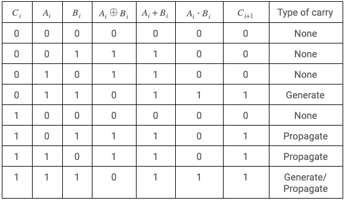

It is seen that $A_i\oplus B_i$ and $A_i + B_i$  differ only when both $A_i$ and $B_i$ are 1 but in this case $C_{i+1}$ will be independent of $P_i$ as $G_i$ is $A_i\cdot B_i$ which will be 1 and $C_{i+1}$ is given by $P_i\cdot C_i + G_i$. Hence we can replace the XOR operations in $P_i$ with an OR operation in the carry lookahead calculation segment of the circuit. 

$C_{i+1}=P_i\cdot C_i+G_i= (A_i + B_i)\cdot C_i + A_i \cdot B_i$

We can see that this carry lookahead design would require the use of AND, OR and XOR functions. We know that complementary logic gates are inverting for CMOS static logic. Hence it will be easier and more efficient to make NAND and NOR gates in static CMOS logic than AND and OR because they would require inverting the outputs of NAND and NOR gates respectively.

We thereby modify the logic functions using the DeMorgan's theorem to replace AND and OR with NAND and NOR wherever possible. 

We take 

$P'_i = \overline{A_i+B_i}$

and

$G'_i = \overline{A_i \cdot B_i}$

Now we have

 $C_1 = \overline{G'_0\cdot (P'_0+\overline{C_0})}$

$C_2 = \overline{G'_1\cdot(P'_1 + G'_0)} + (\overline{P'_1+P'_0}\cdot C_0)$

$C_3 = \overline{G'_2\cdot(P'_2 + G'_1)} + (\overline{P'_2+P'_1}\cdot \overline{G'_0(P'_0+\overline{C_0})})$

$C_4 =\overline{P'_3+P'_2}\cdot \overline{P'_1+P'_0} \cdot C_0 + \overline{G'_3\cdot(P'_3 + G'_2)} + (\overline{P'_3+P'_2}\cdot \overline{G'_1(P'_1+G'_0)})$

Using these equations we can arrive at the following structure for the circuit.

## Diagram

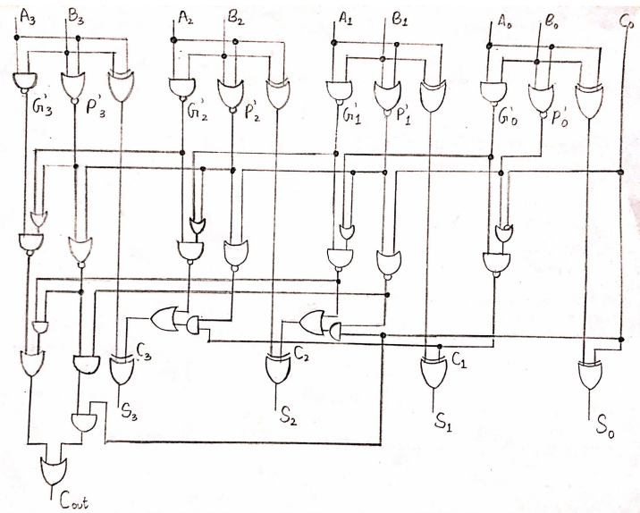

# Design details

## Gates

The width of the transistors in each of the gates have been decided to match that of the ideal inverter in order to obtain equal rise and fall times and minimize delays and uncertainties.

### NOT

We know the ideal inverter has widths as follows 

$W_P=2W$

$W_N=W$

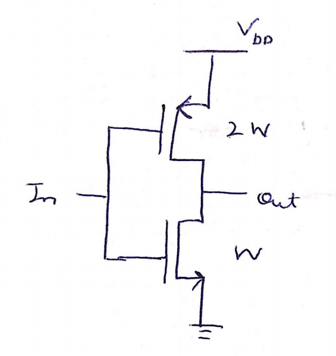

### NAND

The NAND gate consists of 2 PMOS transistors in parallel in the pull-up network and 2 NMOS transistors in series in the pull-down network. We know that the $\frac{W_P}{W_N}$  ratio has to be $\frac{2}{1}$ for the gate to perform ideally. For this we consider the worse case scenario where only one input is on and determine the size of the inverters. We get 

$W_P=2W$

$W_N=2W$

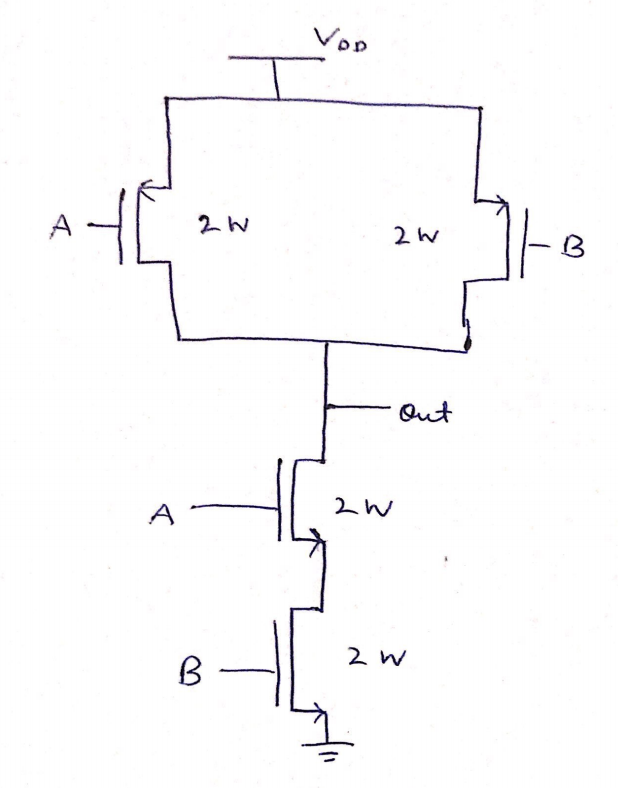

### NOR

The NOR gate consists of 2 PMOS transistors in series in the pull-up network and 2 NMOS transistors in parallel in the pull-down network. We know that the $\frac{W_P}{W_N}$  ratio has to be $\frac{2}{1}$ for the gate to perform ideally. For this we consider the worse case scenario where only one input is on and determine the size of the inverters. We get 

$W_P=4W$

$W_N=W$

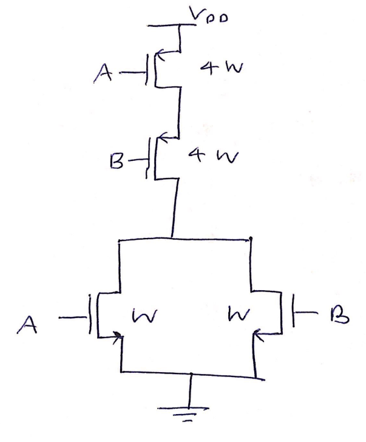

### XOR

The XOR gate consists of 4 PMOS transistors which are arranged in 2 networks in series consisting of 2 PMOS transistors in parallel in the pull-up network and 4 NMOS transistors which are arranged in 2 networks in parallel consisting of 2 NMOS transistors in series each in the pull-down network. We know that the $\frac{W_P}{W_N}$  ratio has to be $\frac{2}{1}$ for the gate to perform ideally. For this we consider the worse case scenario where only one input is on and determine the size of the inverters. We get 

$W_P=4W$

$W_N=2W$

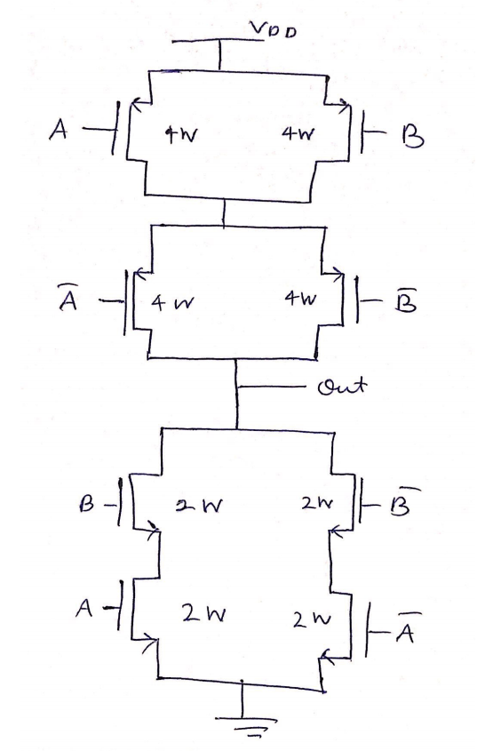

## Adder Modules

### Propagate and Generate

The PG module I will be using should be able to generate $P_i$, $P'_i$ and $G'_i$. Hence, it will consist of one XOR, one NOR and one NAND gate.

The circuit will be as follows

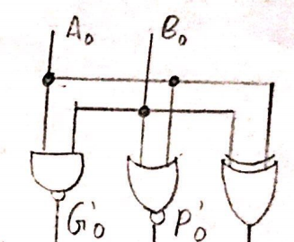

### Carry Lookahead

The carry lookahead logic will make use of NOT,NAND and NOR gates as follows

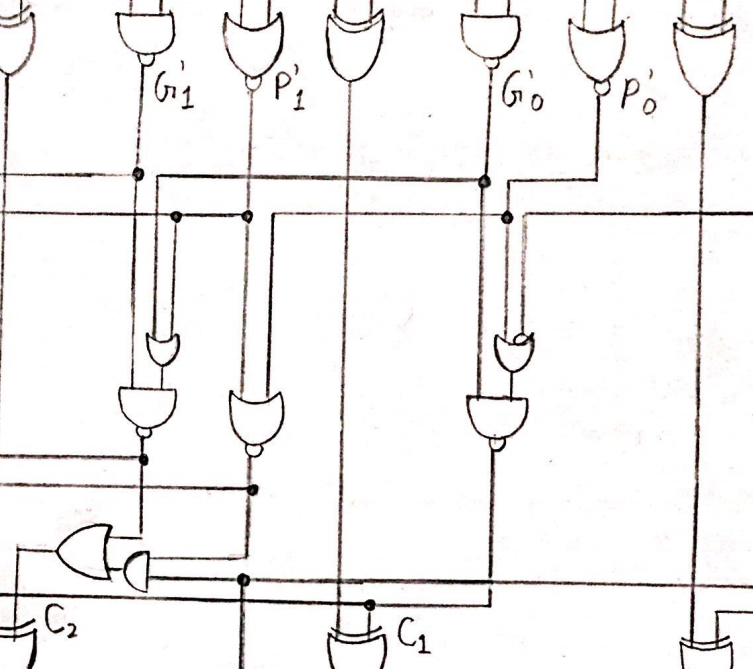

### Sum Block

The sum block will simply consist of an XOR gate.

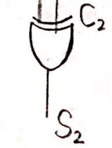

## D-flip-flop

The D-flipflop will consist of NAND gates arranged as follows

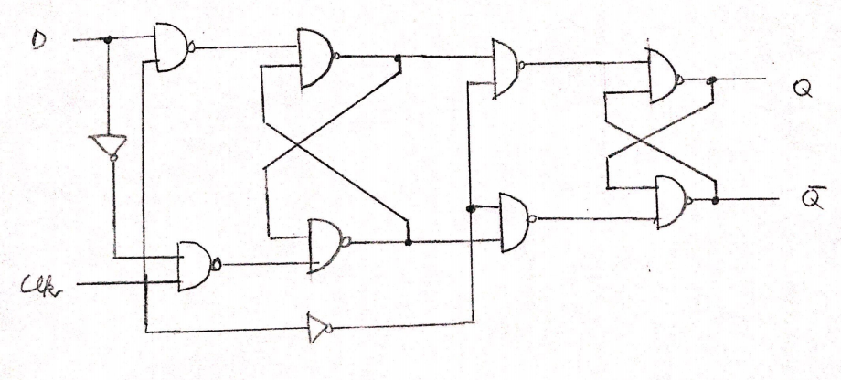

### Load Capacitance

We are given that each of the output bits need to be able to drive an inverter of size $\frac{W_P}{W_N}=\frac{20\lambda}{10\lambda}$.

$C_{ox}=\frac{\epsilon_o \epsilon_{SiO_2}}{t_{ox}}$

We know from previous knowledge and tech file that 

$\epsilon_{SiO_2}=8.85 \times 10^{-12}$

$\epsilon_o=3.9$

$t_{ox}=4.1\times 10^{-9}$

Substituting these values we get 

$C_{ox}=\frac{8.85\times 10^{-12}\times 3.9}{4.1\times {10^{-9}}}$

   $= 8.42\times 10^{-3}$

$C = C_{ox} \times (W_N+W_P) \times L$

$= 8.42 \times 10^{-3}\times 30\lambda \times 2\lambda$

$= 8.42 \times 10^{-3}\times 60 \times (0.09)^2 \times 10^{-12}$

$= 4.02 \times 10^{-15}$ F

Hence, each. output must drive a load capacitance of 4fF.