# 4-bit Carry Lookahead Adder

The top level design of the carry lookahead adder is as follows

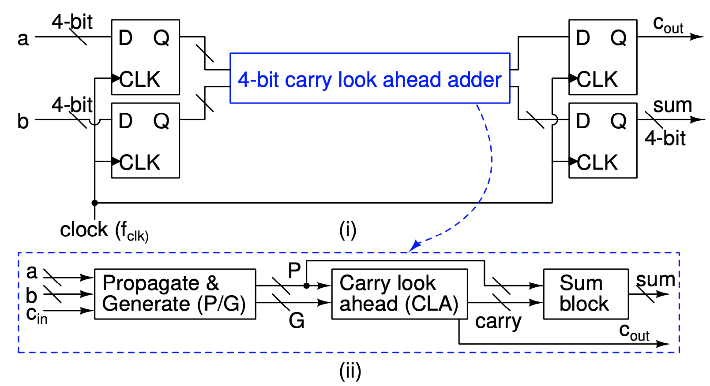

The input and outputs follow the clock pulse as shown

In a CLA adder we input the 4 bit numbers and a carry-in. In the first stage of the CLA we generate the propagate and generate signals for each bit of the input as follows

and the carry out of the ith bit position can be generated as follows 

The Sum can be generated as follows  

# Structure for adder

## Derivation

We have 

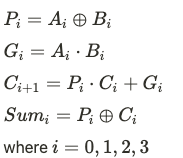

Let the input carry be $C_0$.

using the equation for finding further carries we get 

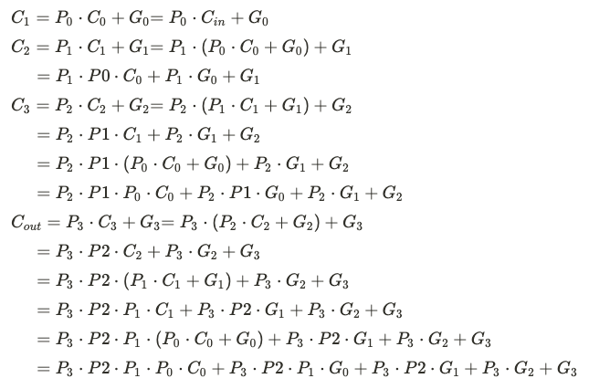

We have the carries of the form

The truth table will be as follows

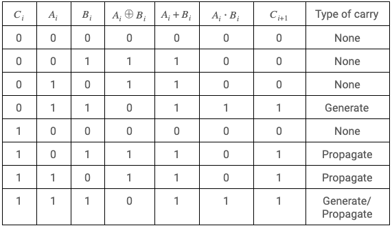

It is seen that XOR and OR differ only when both A and B are 1 but in this case i+1th carry will be independent of P as G is AND which will be 1 which will be 1 and i+1th carry is given by OR of G and AND of P and ith carry. Hence we can replace the XOR operations in P with an OR operation in the carry lookahead calculation segment of the circuit. 

We can see that this carry lookahead design would require the use of AND, OR and XOR functions. We know that complementary logic gates are inverting for CMOS static logic. Hence it will be easier and more efficient to make NAND and NOR gates in static CMOS logic than AND and OR because they would require inverting the outputs of NAND and NOR gates respectively.

We thereby modify the logic functions using the DeMorgan's theorem to replace AND and OR with NAND and NOR wherever possible. 

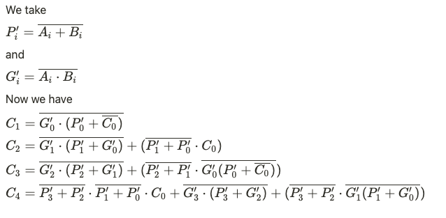

Using these equations we can arrive at the following structure for the circuit.

## Diagram

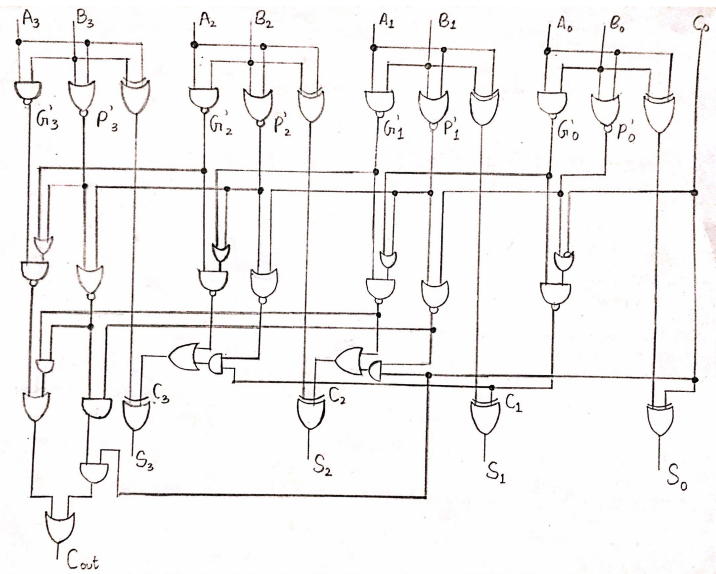

# Design details

## Gates

The width of the transistors in each of the gates have been decided to match that of the ideal inverter in order to obtain equal rise and fall times and minimize delays and uncertainties.

### NOT

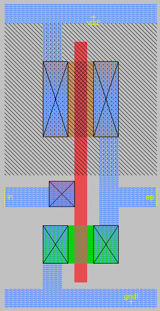

### NAND

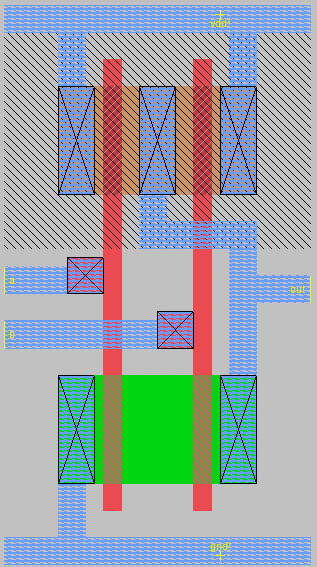

### NOR

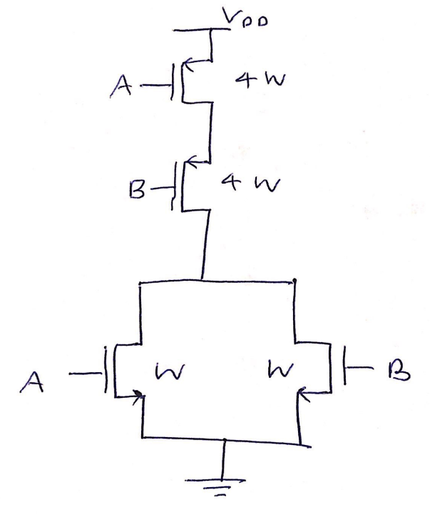

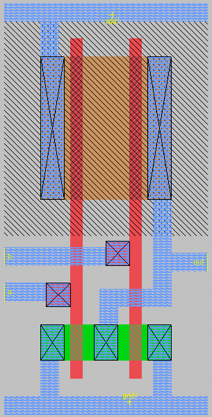

### XOR

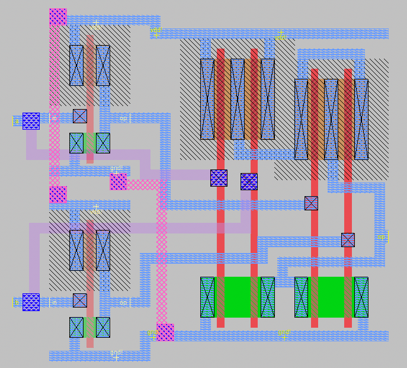

## D-flip-flop

The D-flipflop will consist of NAND gates arranged as follows

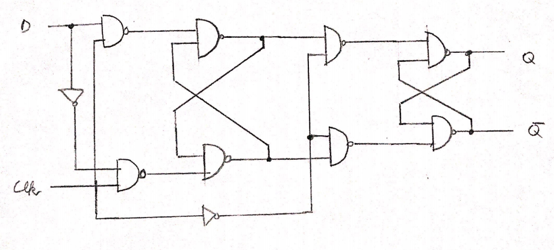

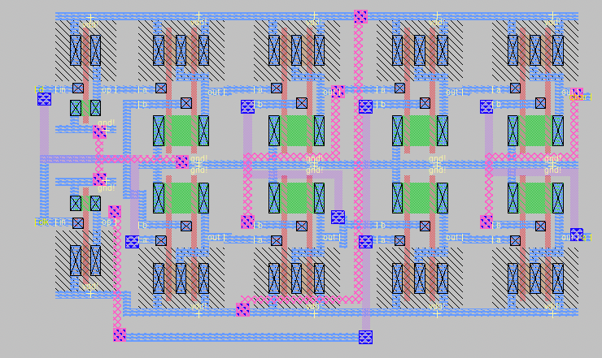

# Floor plan

### Initial floor plan

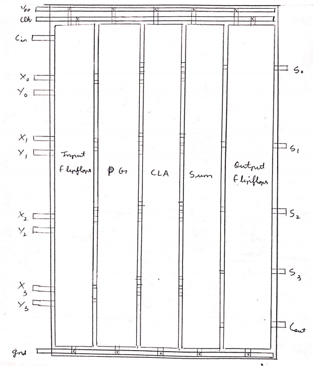

### Initial layout

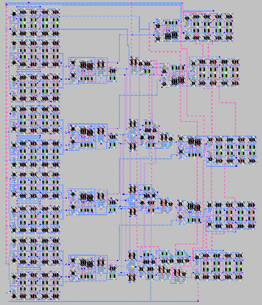

### Revised floor plan

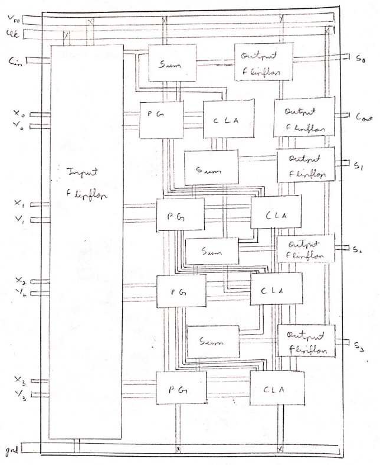

### Revised layout

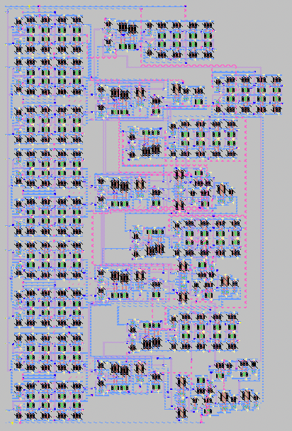

# References

1. J. Miao and S. Li, "A novel implementation of 4-bit carry look-ahead adder," 2017 International Conference on Electron Devices and Solid-State Circuits (EDSSC), 2017, pp. 1-2, doi: 10.1109/EDSSC.2017.8126457.
2. CMOS VLSI Design (fourth edition) by Weste and Harris.
3. Pai, Y. and Y. Chen. “The fastest carry lookahead adder.” Proceedings. DELTA 2004. Second IEEE International Workshop on Electronic Design, Test and Applications (2004): 434-436.
